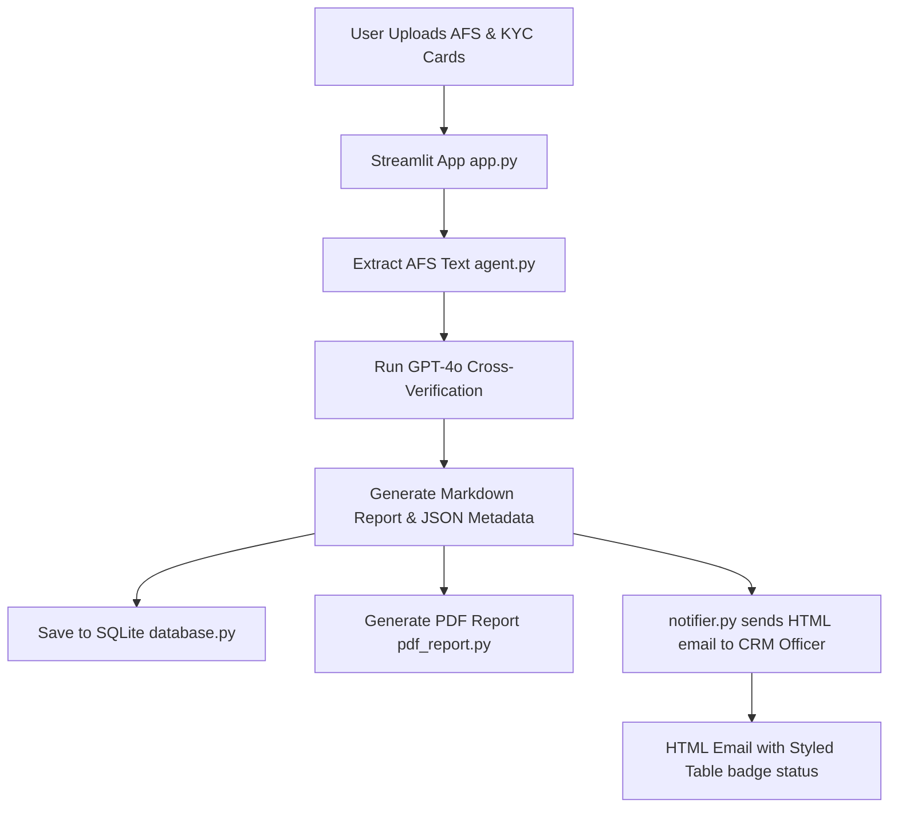

# Real Estate KYC Verification Agent 📋

[](https://www.python.org/)
[](https://streamlit.io/)
[](https://openai.com/)

An AI-powered agentic system that automates the verification of client details in **Agreement for Sale (AFS)** documents against official KYC documents (**Aadhaar** and **PAN** cards). The system cross-verifies multiple fields (Full Name, Father's Name, DOB, PAN, Aadhaar, and Addresses), logs verification history, generates premium PDF reports, and alerts the CRM team with rich HTML emails featuring interactive comparison tables.

---

## 🌟 Key Features

- **Document Parsing**: Automatic text and structured markdown extraction from AFS PDFs using Microsoft `MarkItDown` and `PyMuPDF`.
- **AI-Powered Cross-Verification**: Leverages GPT-4o to perform character-perfect verification of client identities, supporting joint owners and co-applicants.
- **Strict Logic Matching**: Zero-tolerance checks on Names, Date of Birth, PAN, Aadhaar, and Address components (handling abbreviations and masked card formats).
- **Interactive CRM Alerts**: Automatically dispatches beautiful HTML emails to CRM officers containing a visual match/mismatch status table directly in their inbox.
- **Premium PDF Reports**: Generates professional, branded PDF reports featuring client metadata cards, verification status badges, and styled tables.
- **Historical Records**: Logs every run in a local SQLite database for compliance, review, and re-downloading reports.

---

## 🔄 End-to-End Workflow



1. **Document Upload**: The user uploads the AFS PDF along with images or PDFs of Aadhaar and PAN cards via `app.py`.
2. **Text & Vision Extraction**:
   - The AFS PDF text is extracted in `agent.py` using `MarkItDown`.
   - Aadhaar and PAN cards are processed and parsed as base64 images.
   - The compiled payload is sent to GPT-4o with instructions from `system_prompt.md`.
3. **Meticulous Cross-Checking**:
   - GPT-4o maps Aadhaar and PAN cards to the corresponding buyers/co-applicants in the AFS.
   - It performs field-by-field verification (Names, Father's Name, DOB, PAN, Aadhaar, and Addresses).
   - Critical anomalies, masked cards, NRI status, or missing KYC files for co-applicants are detected.
4. **Report & Metadata Generation**:
   - GPT-4o returns a Markdown comparison report and a clean JSON object containing metadata status.
5. **Database Logging**: The verification session metadata is recorded in SQLite via `database.py`.
6. **PDF Creation**: `pdf_report.py` compiles the report into a downloadable PDF document featuring corporate-style cover pages, details cards, and matching badges.
7. **CRM Notification Email**:
   - `notifier.py` converts the comparison Markdown table into a fully styled HTML email using responsive inline CSS.
   - Status indicators (`✅`, `❌`, `⚠️`) are converted to color-coded badges, enabling the CRM team to instantly pinpoint discrepancies from their inbox.

---

## 📁 Repository Structure

```bash
├── app.py                  # Streamlit frontend & dashboard interface
├── agent.py                # Text extraction (MarkItDown/PyMuPDF) and GPT-4o verification logic
├── system_prompt.md        # AI System Instructions, matching logic, and matching guidelines
├── notifier.py             # Logic for building and sending styled HTML reports via SMTP
├── pdf_report.py           # Engine for generating premium PDF verification documents
├── database.py             # Local SQLite database configurations for logging history
├── requirements.txt        # Project package dependencies
└── .env.example            # Template for environment variables (API keys and SMTP credentials)
```

---

## 🚀 Quick Start

### 📋 Prerequisites

Make sure you have Python 3.10+ installed on your machine.

### 💻 Installation

1. **Clone the repository:**
   ```bash
   git clone https://github.com/your-username/afs-verification-agent.git
   cd afs-verification-agent
   ```

2. **Install dependencies:**
   ```bash
   pip install -r requirements.txt
   ```

3. **Configure Environment Variables:**
   Duplicate the `.env.example` file to `.env`:
   ```bash
   cp .env.example .env
   ```
   Open the `.env` file and fill in your credentials:
   ```env
   OPENAI_API_KEY=your_openai_api_key_here
   SMTP_EMAIL=your_gmail_address_here
   SMTP_PASSWORD=your_gmail_app_password_here
   ```

   > [!IMPORTANT]
   > For Gmail, the `SMTP_PASSWORD` must be a 16-character **App Password** generated from your Google Account settings (requires 2-Step Verification enabled).

4. **Run the Application:**
   ```bash
   streamlit run app.py
   ```

### Running Tests

Install the development dependencies, then run the test suite:

```bash
pip install -r requirements-dev.txt
pytest
```

### Deployment

For production deployment, use the step-by-step Streamlit Cloud + Neon Postgres guide in `DEPLOYMENT.md`.

---

## 🔒 Security & Compliance

- **No Data Persistence of KYC**: Aadhaar and PAN card image payloads are processed transiently through OpenAI API and are not stored in any external cloud databases.
- **Credential Storage**: API Keys and email credentials are kept safe in a local `.env` file and excluded from version control via `.gitignore`.
